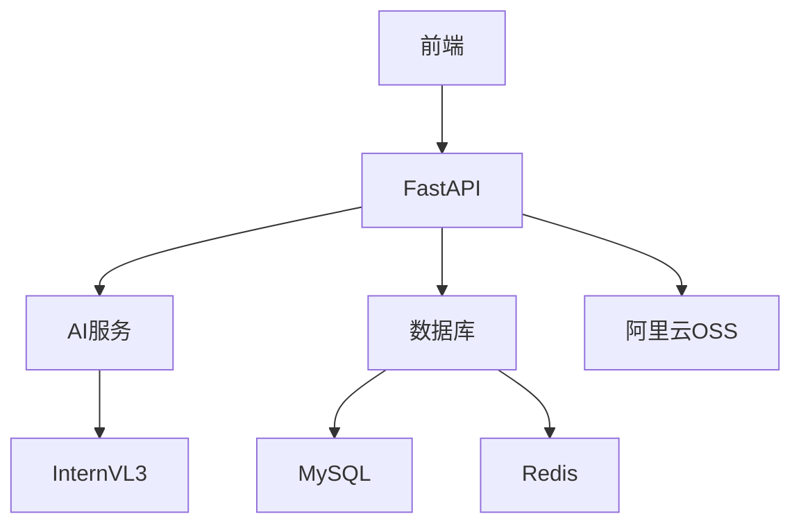
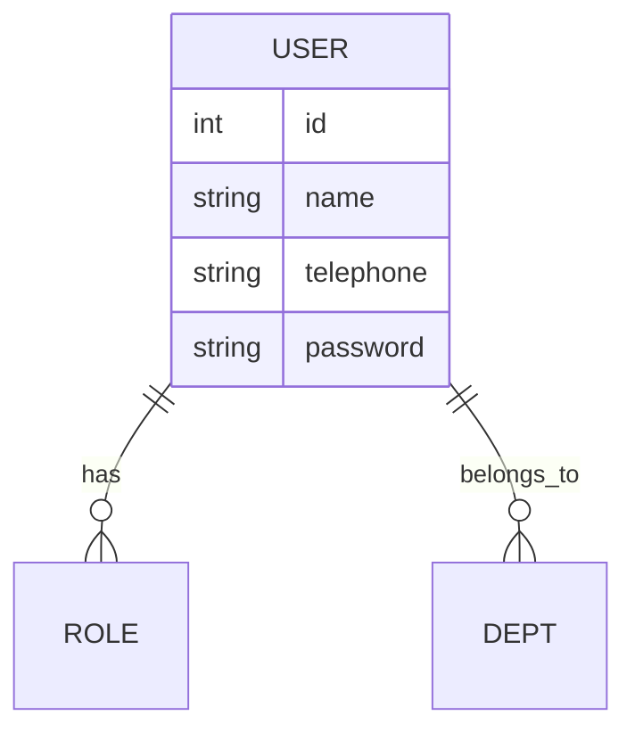
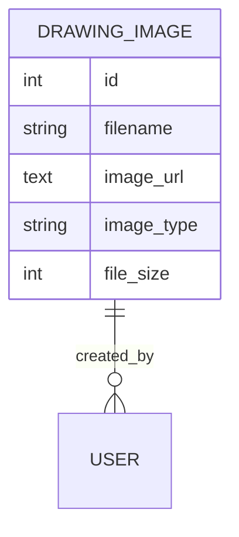

# 项目概述文档

## 1. 业务目标
- 构建基于AI的绘图识别与智能输入平台  
- 实现教育场景下的题目自动识别与分析  
- 提供安全可靠的多租户管理系统  
- 支持跨平台数据交互和资源共享  

## 2. 核心功能模块

### 智能图像处理系统
- 支持JPG/PNG等常见格式  
- 图像元数据提取（尺寸、类型等）  
- 内容分析与识别  
- 题目结构化处理  

### 权限管理系统
- 多级角色权限控制  
- 部门数据隔离  
- 操作审计追踪  

### 资源管理中心
- 图像资源管理  
- 标签分类系统  
- 访问权限控制  

## 3. 技术架构

## 4. 核心数据实体

### 用户系统

### 绘图资源系统

## 5. 关键业务流程

### 图像上传分析流程
1. 用户上传图像文件  
2. 系统校验文件有效性（类型、大小等）  
3. 生成文件哈希进行幂等校验  
4. 上传至OSS对象存储  
5. 调用AI服务分析图像内容  
6. 存储分析结果和图像元数据  

### 权限验证流程
1. 用户登录获取JWT  
2. 访问API时验证token有效性  
3. 检查用户角色权限  
4. 验证数据访问权限（部门隔离）  
5. 记录操作日志  

## 6. 扩展能力
- 支持多AI模型并行分析  
- 可配置的题目识别模板  
- 灵活的图像标签系统  
- 完善的API文档体系  